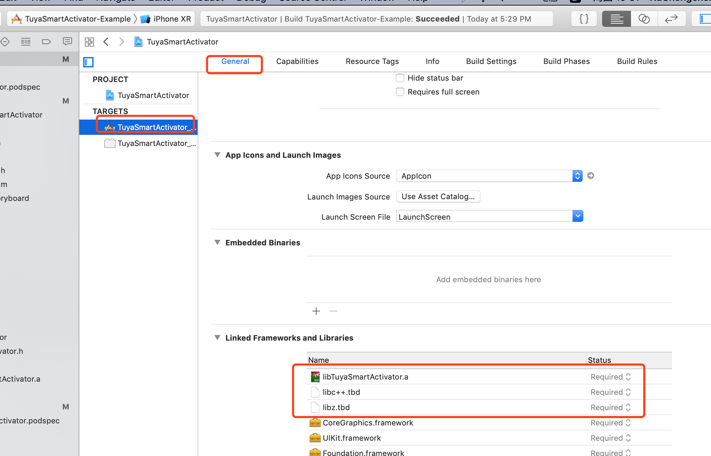

#### 注意：当前仓库继承自即将被废弃的涂鸦Github仓库：https://github.com/TuyaInc/tuyasmart_ios_activator_sdk ，请使用当前 Github 仓库进行涂鸦 SDK相关开发。更换远程Github仓库URL的教程，可以参考：https://docs.github.com/cn/free-pro-team@latest/github/using-git/changing-a-remotes-url

# 涂鸦智能配网 iOS SDK（云云对接方案）

[中文版](README-zh.md) | [English](README.md)

---

## 功能概述

涂鸦智能配网 SDK 提供了 AP，EZ 模式，Zigbee 网关配网和 WiFi + BLE 双模配网的功能，开始配网和停止配网要结合使用。主要是配合云云对接使用。

## 快速集成 (推荐)

### 使用 Cocoapods 集成

在 `Podfile` 文件中添加以下内容：

```ruby
platform :ios, '8.0'

target 'your_target_name' do

   pod "TuyaSmartActivator"

end
```

然后在项目根目录下执行 `pod update` 命令，集成第三方库。

CocoaPods 的使用请参考：[CocoaPods Guides](https://guides.cocoapods.org/)


## 手动集成 (不推荐)

涂鸦智能 iOS SDK 依赖的第三方库有:

- CocoaAsyncSocket

依赖的系统链接库有:

- libc++
- libz


### 使用 CocoaPods 添加第三方库依赖:

在项目根目录 `Podfile` 文件中添加以下内容,然后保存退出.

```ruby
platform :ios, '8.0'
	
target 'Your_App_Name' do
	pod "CocoaAsyncSocket"
end
```

在项目根目录下执行 `pod install` 命令,来集成第三方库.

### 添加系统库依赖:

在项目的 `Target -> Build Phases -> Link Binary With Libraries` 添加 `libc++`, `libz` 系统链接库:





## 涂鸦全量 SDK 兼容问题（没有引入全量 SDK 的忽略）

如果接入了 IPC SDK，会依赖到涂鸦全量 SDK，涂鸦智能配网 iOS SDK（云云对接方案）pod 集成需要使用特定的分支：

```ruby
platform :ios, '8.0'

target 'your_target_name' do

   pod 'TuyaSmartActivator', :git => 'https://github.com/TuyaInc/tuyasmart_ios_activator_sdk.git', :branch => 'develop_compatible'

end
```


## 设备配网

涂鸦硬件模块支持四种配网模式：快连模式（TLink，简称 EZ 模式）、热点模式（AP 模式）、Zigbee 网关配网，BLE +  Wi-Fi 双模配网。快连模式操作较为简便，建议在配网失败后，再使用热点模式作为备选方案。Zigbee 网关配网需要网关和路由器在一个局域网内进行配网。BLE + Wi-Fi 双模配网需要开启蓝牙进行设备搜索后进行配网。

### 获取 Token

通过云云对接获取配网的信息串，里面包含有

```json
{
  "secret":"reKE",
  "region":"AY",
  "token":"nqMwn1Nd"
}

// 配网所需的 token = region + token + secret
// 以上为例, 传递给下列方法的 token = "AYnqMwn1NdreKE" = "AY" + "nqMwn1Nd" + "reKE" 
```

> 需要对配网 token 信息进行拼接，错误的 token、未拼接的 token 会导致设备激活、配网失败

### EZ 模式配网

```objective-c
// start config wifi EZ mode
NSString *ssid = @"";
NSString *password = @"";
NSString *token = @""; // 组装后的 token
[[TuyaSmartActivator sharedInstance] startConfigWiFiWithMode:TYActivatorModeEZ ssid:ssid password:password token:token];
```

### 停止配网

开始配网操作后，APP会持续广播配网信息（直到配网成功，或是超时）。如果需要中途取消操作或配网完成，需要调用`[TuyaSmartActivator stopConfigWiFi]`方法。

```
- (void)stopConfigWifi {
    [[TuyaSmartActivator sharedInstance] stopConfigWiFi];
}
```

### AP 模式配网

```objective-c
// start config wifi AP mode
- (void)startConfig {
    NSString *ssid = @"";
    NSString *password = @"";
    NSString *token = @""; // 组装后的 token
    [[TuyaSmartActivator sharedInstance] startConfigWiFiWithMode:TYActivatorModeAP ssid:ssid password:password token:token];
}

// stop config
- (void)stopConfigWifi {
    [[TuyaSmartActivator sharedInstance] stopConfigWiFi];
}
```

### Zigbee 网关配网 

```objective-c
// start config Zigbee Gateway
- (void)startConfig {
    NSString *token = @""; // 组装后的 token
    [[TuyaSmartActivator sharedInstance] startConfigWiredDeviceWithToken:token];
}

// stop config
- (void)stopConfigWifi {
    [[TuyaSmartActivator sharedInstance] stopConfigWiFi];
}
```

### BLE + Wi-Fi 双模配网 

```objective-c
// start discovery device with bluetooth
- (void)startDiscovery {
    [[TuyaSmartActivator sharedInstance] startDiscovery:^(TYBLEAdvModel *model){
      
    }];
}

// stop discovery
- (void)stopDiscovery {
    [[TuyaSmartActivator sharedInstance] stopDiscovery];
}

// start config
- (void)startConfigBLEWifi {
    TYBLEAdvModel *model = #<startDiscovery result>;
    NSString *authKey = @""; // from clund
    NSString *random = @""; // from random
    NSString *ssid = @"";
    NSString *password = @"";
    NSString *token = @""; // 组装后的 token
  
    [[TuyaSmartActivator sharedInstance] startConfigBLEWifiWithAdvModel:model
                                                                authKey:authKeyauthKey
                                                                 random:random
                                                                   ssid:ssid
                                                               password:password
                                                                  token:token];
}

// stop config
- (void)stopConfigBLEWifi {
    [[TuyaSmartActivator sharedInstance] stopConfigBLEWifiWithAdvModel:#<discoveryModel>];
}
```

